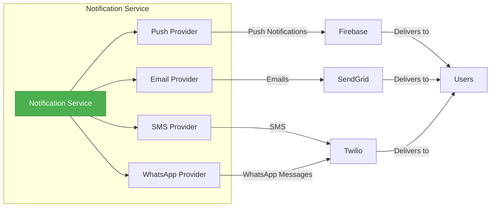
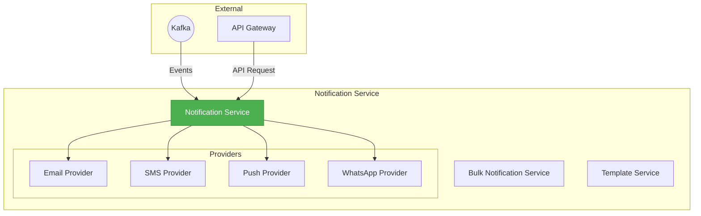

# notification-service

# Notification Service

<div align="center">


[](https://github.com/yourusername/notification-service/actions)
[](https://github.com/yourusername/notification-service/actions)
[](LICENSE)
[](https://hub.docker.com/r/yourusername/notification-service)
[](https://api.yourdomain.com/docs)

**A scalable, multi-channel notification service for modern applications**

</div>

## Overview

The Notification Service is a powerful, event-driven microservice designed to handle all your application's communication needs across multiple channels. Built with clean architecture principles and designed for high scalability, it ensures timely and reliable communication for all types of events and user interactions.



## ✨ Features

- 📱 **Multi-Channel Delivery** - Send notifications via Email, SMS, Push notifications, and WhatsApp
- 🔄 **Event-Driven Architecture** - Seamlessly integrates with Kafka event streams
- 📋 **Template Management** - Customizable templates for different notification types and channels
- 📊 **Delivery Tracking** - Complete visibility into notification status and delivery metrics
- 🚀 **Bulk Operations** - Efficiently send the same notification to multiple recipients
- 🔌 **Extensible Provider System** - Easily add new notification channels
- 📱 **Push Notifications** - Firebase Cloud Messaging integration for cross-platform push capabilities
- 🔒 **Secure by Design** - Comprehensive security controls and data protection
- 📈 **High Performance** - Designed for high throughput with minimal latency
- 🔍 **Comprehensive Monitoring** - Integration with ELK and Prometheus for observability

## 🚀 Quick Start

### Prerequisites

- Docker and Docker Compose
- .NET 8 SDK (for development)
- PostgreSQL
- Kafka
- Redis (optional, for caching)

### Using Docker

The easiest way to run the service is with Docker:

```bash
# Clone the repository
git clone https://github.com/yourusername/notification-service.git
cd notification-service

# Start with Docker Compose
docker-compose up -d
```

This will start the Notification Service along with the required dependencies (PostgreSQL, Kafka, ZooKeeper, and Redis).

### Environment Configuration

The service can be configured using environment variables:

```
# Database
POSTGRES_CONNECTION_STRING=Host=postgres;Database=notifications;Username=notifyuser;Password=password

# Kafka
KAFKA_BOOTSTRAP_SERVERS=kafka:9092
KAFKA_GROUP_ID=notification-service
KAFKA_TOPIC_SYSTEM_EVENTS=system-events
KAFKA_TOPIC_USER_EVENTS=user-events

# Authentication
JWT_AUTHORITY=https://auth.yourdomain.com
JWT_AUDIENCE=notify-api

# Email (SendGrid)
SENDGRID_API_KEY=your_sendgrid_api_key
SENDGRID_FROM_EMAIL=notifications@yourdomain.com
SENDGRID_FROM_NAME=Notifications

# SMS & WhatsApp (Twilio)
TWILIO_ACCOUNT_SID=your_twilio_account_sid
TWILIO_AUTH_TOKEN=your_twilio_auth_token
TWILIO_WHATSAPP_FROM=+1234567890

# Push Notifications (Firebase)
FIREBASE_PROJECT_ID=your-firebase-project-id
FIREBASE_CREDENTIAL_PATH=/app/firebase-credentials.json
```

## 📚 API Documentation

The API documentation is available at `/swagger` when the service is running. The main endpoints include:

### Notifications

- `POST /api/notifications` - Send a notification
- `GET /api/notifications/{id}` - Get notification details
- `GET /api/notifications` - List notifications with filtering

### Bulk Notifications

- `POST /api/bulk-notifications` - Create a bulk notification job
- `GET /api/bulk-notifications/{id}` - Get job status
- `GET /api/bulk-notifications` - List bulk notification jobs

### Templates

- `GET /api/templates` - List notification templates
- `POST /api/templates` - Create a new template
- `PUT /api/templates/{id}` - Update an existing template

### Device Registrations

- `POST /api/device-registrations` - Register a new device
- `DELETE /api/device-registrations/{token}` - Deactivate a device
- `POST /api/device-registrations/topics/{topic}/subscribe` - Subscribe to topic

## 🏗️ Architecture

The Notification Service follows Clean Architecture principles with four main layers:

```
NotificationService/
├── Domain/             # Entities, value objects, and business rules
├── Application/        # Use cases and business logic
├── Infrastructure/     # External concerns and implementations
└── Api/                # Controllers, models and entry point
```

### System Context



## 🔧 Development

### Building from Source

```bash
# Clone the repository
git clone https://github.com/yourusername/notification-service.git
cd notification-service

# Build the solution
dotnet restore
dotnet build

# Run tests
dotnet test

# Run the service
dotnet run --project src/NotificationService.Api/NotificationService.Api.csproj
```

### Architecture Decision Records

We maintain Architecture Decision Records (ADRs) to document significant architectural decisions. These can be found in the `docs/adr` directory.

### Code Style

This project uses .NET analyzers and `.editorconfig` to enforce code style rules. Please ensure your IDE respects these settings.

## 🧪 Testing

The solution includes comprehensive test coverage:

- **Unit Tests**: Testing individual components in isolation
- **Integration Tests**: Testing components with their dependencies
- **System Tests**: End-to-end testing of the API endpoints

To run the tests:

```bash
# Run all tests
dotnet test

# Run only unit tests
dotnet test --filter Category=Unit

# Run with coverage
dotnet test /p:CollectCoverage=true /p:CoverletOutputFormat=opencover
```

## 📊 Monitoring

The service exports metrics in Prometheus format at the `/metrics` endpoint, and includes the following monitoring components:

- Health checks at `/health`, `/health/live`, and `/health/ready` endpoints
- Structured logging with Serilog
- Integration with Elasticsearch for log storage and analysis
- Correlation ID tracking for distributed tracing
- Performance monitoring for slow requests

## 🔐 Security

### Authentication

The API uses JWT Bearer token authentication. Tokens must be obtained from the identity provider and included in the `Authorization` header.

### Authorization

Role-based access control is implemented for administrative endpoints. The following roles are defined:

- `notification:read` - Read access to notifications
- `notification:write` - Ability to send notifications
- `notification:admin` - Full administrative access

## 🌐 Deployment

### Kubernetes

Kubernetes manifests are provided in the `k8s` directory. To deploy to a Kubernetes cluster:

```bash
kubectl apply -f k8s/namespace.yaml
kubectl apply -f k8s/configmap.yaml
kubectl apply -f k8s/secret.yaml
kubectl apply -f k8s/deployment.yaml
kubectl apply -f k8s/service.yaml
kubectl apply -f k8s/ingress.yaml
```

### Helm Chart

A Helm chart is available for more advanced deployment scenarios:

```bash
helm repo add notification-service https://charts.yourdomain.com
helm install notification-service notification-service/notification-service -f values.yaml
```

## 📱 Use Cases

The Notification Service is designed to handle a wide variety of notification scenarios:

- **User Account Events**: Registration confirmations, password resets, security alerts
- **Business Process Updates**: Order statuses, shipping updates, appointment reminders
- **System Alerts**: Critical system events, maintenance notifications, outage communications  
- **Marketing Communications**: Promotions, newsletters, product announcements
- **Team Collaboration**: Task assignments, approvals, mentions, comments
- **IoT & Device Notifications**: Sensor readings, device status changes, alerts
- **Social Features**: Friend requests, message notifications, activity digests

## 🧩 Integration Examples

### Kafka Event Listener

```csharp
// Example of an event handler that listens for events and triggers notifications
public class OrderEventHandler : INotificationEventHandler<OrderStatusChangedEvent>
{
    private readonly INotificationService _notificationService;
    
    public OrderEventHandler(INotificationService notificationService)
    {
        _notificationService = notificationService;
    }
    
    public async Task HandleAsync(OrderStatusChangedEvent @event, CancellationToken cancellationToken)
    {
        await _notificationService.SendAsync(new Notification
        {
            Type = NotificationType.StatusUpdate,
            RecipientId = @event.CustomerId,
            Channel = NotificationChannel.Email,
            Metadata = new Dictionary<string, string>
            {
                { "orderId", @event.OrderId.ToString() },
                { "status", @event.NewStatus.ToString() },
                { "timestamp", @event.Timestamp.ToString("o") }
            }
        }, cancellationToken);
    }
}
```

### REST API Integration

```csharp
// Example of integrating with the REST API from a client application
public async Task SendNotification(string userId, string message)
{
    var client = new HttpClient();
    client.DefaultRequestHeaders.Authorization = new AuthenticationHeaderValue("Bearer", _tokenProvider.GetToken());
    
    var request = new
    {
        recipientId = userId,
        channel = "Push",
        type = "Message",
        metadata = new
        {
            title = "New Message",
            body = message,
            priority = "high"
        }
    };
    
    var response = await client.PostAsJsonAsync("https://api.yourdomain.com/api/notifications", request);
    response.EnsureSuccessStatusCode();
}
```

## 📜 License

This project is licensed under the MIT License - see the [LICENSE](LICENSE) file for details.

## 👥 Contributing

Contributions are welcome! Please read our [CONTRIBUTING.md](CONTRIBUTING.md) for details on our code of conduct and the process for submitting pull requests.

## 🙏 Acknowledgements

- [SendGrid](https://sendgrid.com/) for email delivery
- [Twilio](https://www.twilio.com/) for SMS and WhatsApp integration
- [Firebase](https://firebase.google.com/) for push notifications
- [Confluent Kafka](https://www.confluent.io/) for event streaming
- [Serilog](https://serilog.net/) and [ELK Stack](https://www.elastic.co/elastic-stack) for logging
